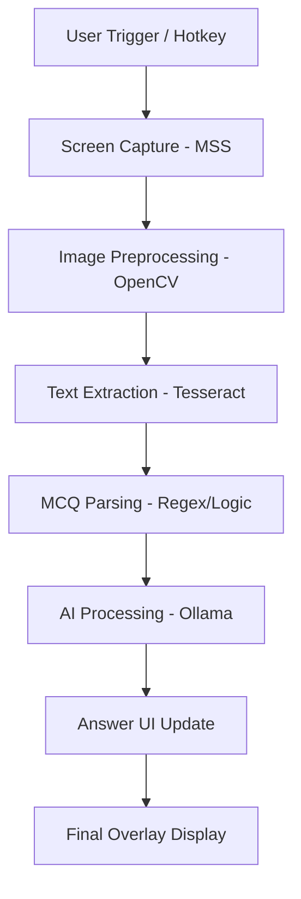

# 🎓 StudyAssistant AI: Your Personal Local AI Tutor

[](https://www.python.org/downloads/)
[](https://opensource.org/licenses/MIT)
[](https://ollama.com/)
[](https://github.com/tesseract-ocr/tesseract)

**StudyAssistant AI** is a professional, high-performance desktop application designed to automate the process of solving multiple-choice questions (MCQs) in real-time. By combining lightning-fast screen capture, advanced OCR, and local Large Language Models (LLMs), it provides a seamless "capture-to-answer" experience—all while keeping your data 100% private and local.

---

## ✨ Key Features

- 📸 **Precision Region Selection**: Define exactly where on your screen the question is located.
- 🔍 **Advanced OCR Extraction**: Powered by Tesseract and OpenCV with adaptive preprocessing for maximum accuracy.
- 🧠 **Local AI Intelligence**: Integrates with **Ollama** to run state-of-the-art models like `Llama 3.2` or `Phi-3` on your own hardware.
- 🚀 **Real-Time Pipeline**: Experience the full flow from screen capture to AI answer in seconds.
- 🖥️ **Single-Window Assistant**: A compact, modern floating UI that stays on top and provides all the info you need.
- 🛡️ **Privacy First**: No cloud APIs, no data collection. Everything stays on your machine.
- ⌨️ **Global Hotkeys**: Trigger scans instantly with `Ctrl+Shift+A`.

---

## 🛠️ Tech Stack

| Technology | Purpose | Why? |
| :--- | :--- | :--- |
| **Python** | Core Language | Versatility and rich library ecosystem for AI/CV. |
| **Tkinter** | UI Framework | Lightweight, native look, and excellent thread safety for desktop apps. |
| **OpenCV** | Image Processing | High-performance preprocessing (Grayscale, Adaptive Thresholding). |
| **MSS** | Screen Capture | Ultra-fast, cross-platform screen grabbing with minimal overhead. |
| **Tesseract OCR** | Text Extraction | Industry-standard open-source OCR engine. |
| **Ollama** | Local LLM Engine | The easiest way to run powerful AI models locally and privately. |
| **Threading/Queue** | Concurrency | Ensures a smooth, non-blocking UI during heavy OCR/AI tasks. |

---

## 📐 Architecture & Workflow

The application follows a modular pipeline architecture designed for speed and transparency:



1.  **Screen Capture**: MSS grabs a high-resolution snapshot of the user-defined region.
2.  **Preprocessing**: OpenCV applies adaptive Gaussian thresholding to make text pop for the OCR.
3.  **OCR**: Tesseract extracts raw text from the processed image.
4.  **Parsing**: A custom parser identifies the question and separates the options (A, B, C, D).
5.  **AI Engine**: The question is sent to Ollama with a specialized "Expert Tutor" prompt.
6.  **Result**: The answer is parsed and displayed in a modern, easy-to-read floating window.

---

## 🚀 Getting Started (Windows)

### 1. Prerequisites

- **Python 3.8+**: [Download here](https://www.python.org/downloads/)
- **Tesseract OCR**: [Download Installer](https://github.com/UB-Mannheim/tesseract/wiki) (Note your installation path, e.g., `C:\Program Files\Tesseract-OCR`)
- **Ollama**: [Download here](https://ollama.com/)

### 2. Setup Ollama Model

Once Ollama is installed, open your terminal and pull a fast model (recommended: `llama3.2:1b` or `phi3`):

```bash
ollama pull llama3.2:1b
```

### 3. Installation

Clone the repository and install the Python dependencies:

```bash
git clone https://github.com/YourUsername/StudyAssistant-AI.git
cd StudyAssistant-AI
pip install -r requirements.txt
```

### 4. Configuration

Open `config.py` and update the `TESSERACT_CMD` path to match your installation:

```python
TESSERACT_CMD = r'C:\Program Files\Tesseract-OCR\tesseract.exe'
```

---

## 📖 How to Use

1.  **Launch the App**: Run `python main.py`.
2.  **Select Region**: Click the **SELECT REGION** button. A transparent box will appear—drag and resize it over your question area.
3.  **Trigger Scan**: 
    - Click **START SCAN** in the UI, or
    - Use the global hotkey: `Ctrl + Shift + A`.
4.  **View Results**:
    - Watch the **EXTRACTED OCR TEXT** box to verify the capture.
    - Wait a few seconds for the **AI RESPONSE** to appear at the bottom.
5.  **Test Connection**: Use the **TEST AI (2+2)** button to ensure your Ollama server is responding correctly.

---

## 📂 Project Structure

```text
StudyAssistant/
├── main.py              # Entry point & Core logic controller
├── dashboard.py         # Compact single-window UI (AssistantUI)
├── capture.py           # Screen capture (MSS) & Region selection box
├── ocr.py               # Image preprocessing & Tesseract integration
├── answer_engine.py     # AI communication (Ollama API)
├── parser.py            # MCQ text parsing logic
├── config.py            # Central configuration & constants
└── requirements.txt     # Project dependencies
```

---

## 🔧 Implementation Details

- **MSS Integration**: We use the `mss` library because it avoids the performance bottlenecks of `PIL.ImageGrab` and provides raw pixel data directly to NumPy/OpenCV.
- **Adaptive OCR**: Instead of simple thresholding, we use `cv2.adaptiveThreshold` to handle different UI themes (Dark/Light mode) automatically.
- **Thread Safety**: All heavy tasks run in background threads. We use a `queue.Queue` to safely pass UI update tasks back to the Tkinter main loop.
- **Expert Prompting**: Our AI engine uses a structured "Expert Study Assistant" prompt to force the model to reason through "NOT" and "EXCEPT" questions before answering.

---

## 🆘 Troubleshooting

| Issue | Solution |
| :--- | :--- |
| **Ollama Timeout** | Ensure Ollama is running in the background. If your hardware is slow, increase `AI_TIMEOUT` in `config.py`. |
| **No Text Detected** | Check `processed_debug.png` in the project folder to see what the OCR sees. Adjust your capture region. |
| **Tesseract Error** | Double-check the `TESSERACT_CMD` path in `config.py`. |
| **AI Returns Garbage** | Try a larger model like `llama3` if your GPU allows. Check if the OCR text was accurate. |

---

## 🗺️ Future Improvements

- [ ] 🌍 **Multi-Language Support**: Expand OCR and AI prompts for non-English exams.
- [ ] 🖼️ **Image-Based AI**: Integrate with LLaVA for questions containing diagrams/charts.
- [ ] 🎙️ **Voice Integration**: Read answers aloud using TTS.
- [ ] 📊 **History Tracking**: Save your scanned questions and AI answers to a local database.
- [ ] ⚡ **GPU Acceleration**: Optimize OpenCV operations using CUDA.

---

## 🤝 Contributing

Contributions are welcome! If you have an idea for a feature or a bug fix, please:
1. Fork the repository.
2. Create a new branch.
3. Submit a pull request.

---

## 📄 License

This project is licensed under the **MIT License**. See [LICENSE](LICENSE) for details.

---

**Disclaimer**: *This tool is intended for study and educational assistance only. Always follow your institution's academic integrity policies.*
